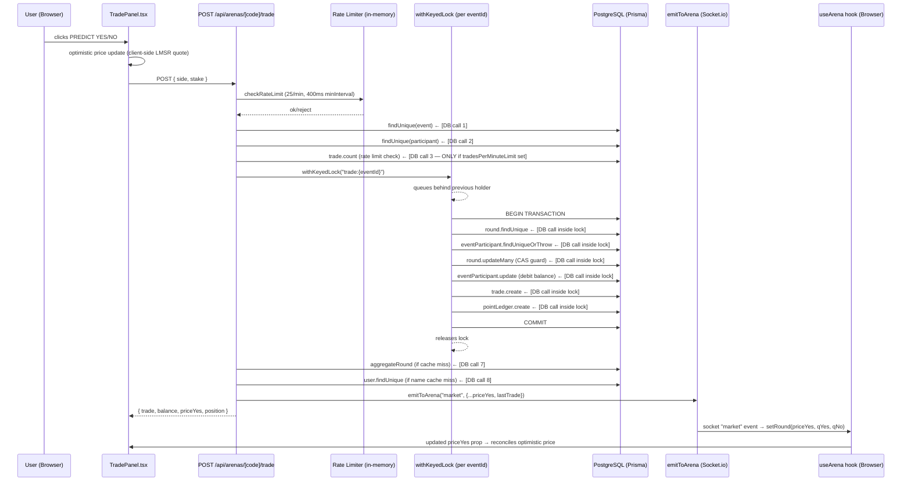

# Order System Choke Analysis

## Complete Buy/Place Order Flow



---

## Identified Choke Points & Root Causes

### 🔴 CHOKE 1 — Sequential DB calls BEFORE the lock (Backend)

**File:** [`trading.ts` L177–L244](file:///c:/Users/Krushna/Documents/Projects/Arena/src/lib/engine/trading.ts#L177-L244)

```typescript
// BEFORE entering withKeyedLock:
const event = await prisma.event.findUnique(...)   // [1] ~5–15ms
const participant = await prisma.eventParticipant.findUnique(...)  // [2] ~5–15ms
const recentTradesCount = await prisma.trade.count(...)  // [3] ~10–50ms (ONLY if tradesPerMinuteLimit set)
```

These **3 sequential DB queries run outside the lock**, so they add 15–80ms of blocking latency before the trade even enters the queue. The `tradesPerMinuteLimit` count query (`prisma.trade.count` with a `createdAt >= oneMinuteAgo` filter on a potentially large trades table) is the **worst offender** — it has no index protection and can degrade to a full table scan under load. Additionally, since these fire before the lock, 10 concurrent users each doing these 3 queries in parallel means 30 simultaneous DB connections are consumed before any order is priced.

---

### 🔴 CHOKE 2 — Keyed lock creates a FIFO queue per arena (Backend)

**File:** [`keyed-lock.ts` L18–L40](file:///c:/Users/Krushna/Documents/Projects/Arena/src/lib/keyed-lock.ts#L18-L40)

The lock key is `trade:{eventId}` — meaning **all trades for one arena are serialized into a single promise chain**. While this prevents optimistic-concurrency collisions, it means:

- With 60 bots firing 2 trades every 500ms tick → **up to 120 trades queued per second**
- Each trade inside the lock takes **~30–100ms** (4–6 DB ops)
- Queue depth grows: trade #60 waits for #1 through #59 to complete → **~1800ms–6000ms of waiting**

A real human clicking BUY joins the back of this queue. The lock serializes legitimately, but **bot volume monopolizes the queue length**.

---

### 🔴 CHOKE 3 — Bots fire too many concurrent trades (Backend)

**File:** [`scheduler.ts` L80–L86](file:///c:/Users/Krushna/Documents/Projects/Arena/src/lib/engine/scheduler.ts#L80-L86)

```typescript
// Every 500ms tick:
void evaluateLiquidityBot(event.id, now, event, round);    // → placeTrade x N
void executeBotMicroTrade(event.id, round.id, 2, ...);     // → placeTrade x 2
void evaluateDemoRoom(event.id, {}, now, event, round);    // → placeTrade x 60 participants
```

Three bot systems fire **concurrently** (`void` = fire-and-forget) on every 500ms tick. `evaluateDemoRoom` with 60 participants generates up to **60 `placeTrade` calls simultaneously** per tick, all queueing behind the same `trade:{eventId}` lock. This is the primary source of human trade latency spikes.

---

### 🟡 CHOKE 4 — `participantPositionCache` stale on first trade (Backend)

**File:** [`trading.ts` L108–L123](file:///c:/Users/Krushna/Documents/Projects/Arena/src/lib/engine/trading.ts#L108-L123)

```typescript
const cached = participantPositionCache.get(cacheKey);
if (cached) return cached;

// CACHE MISS → full table scan on trades table per participant
const trades = await prisma.trade.findMany({ where: { roundId, participantId } });
```

On **first trade per participant per round**, there is no cache — it falls through to `prisma.trade.findMany` scanning all trades for that participant in the round. With 60 bots each placing their first trade at round open, this generates **60 concurrent table scans** all at once at round start, causing a spike in DB load right when latency matters most.

---

### 🟡 CHOKE 5 — `aggregateRound` cache miss at round start (Backend)

**File:** [`round-engine.ts` L68–L83](file:///c:/Users/Krushna/Documents/Projects/Arena/src/lib/engine/round-engine.ts#L68-L83)

```typescript
const cached = roundAggregateCache.get(roundId);
if (cached) return cached;

// CACHE MISS → aggregate query (SUM + COUNT) on all trades
const result = await prisma.trade.aggregate({ where: { roundId }, _sum, _count });
```

`roundAggregateCache` is populated lazily. On round start (cache empty), the **first trade to commit triggers a `trade.aggregate` query** outside the lock — and since multiple bots can exit the lock near-simultaneously, they can all trigger this expensive aggregate before any of them set the cache.

---

### 🟡 CHOKE 6 — `computeLeaderboard` runs 2 expensive queries every 2 seconds (Backend)

**File:** [`round-engine.ts` L143–L213](file:///c:/Users/Krushna/Documents/Projects/Arena/src/lib/engine/round-engine.ts#L143-L213)

```typescript
// Called every 2 seconds during active trading
const participants = await prisma.eventParticipant.findMany(...)  // full sort
const lastResolved = await prisma.round.findFirst(...)             // resolved round scan
const trades = await prisma.trade.findMany({ where: { roundId: lastResolved.id } })  // ALL trades
```

Every 2 seconds, `broadcastLeaderboard` fetches **all participants sorted by balance** and **all trades from the last resolved round** (can be thousands). This competes for DB connections with live trade processing.

---

### 🟡 CHOKE 7 — `sampleTwap` blocks the scheduler for ~6 seconds at round close (Backend)

**File:** [`binance.ts` L172–L199](file:///c:/Users/Krushna/Documents/Projects/Arena/src/lib/price/binance.ts#L172-L199)

```typescript
for (let i = 0; i < count; i++) {
  const tick = await getPrice(symbol, 0);  // forced real HTTP fetch
  if (i < count - 1) {
    await new Promise(resolve => setTimeout(resolve, intervalMs)); // waits 1000ms each
  }
}
// Total blocking time: ~6 seconds (6 samples × 1s interval)
```

The TWAP sampling runs **synchronously inside `resolveRound`**, which is called directly from `advanceArena` → inside the scheduler tick. During the 6-second TWAP window, the arena is marked as `inFlight` and **no new rounds open, no bots fire, and no leaderboard updates happen**. If human trades were submitted just before close, they queue behind the TWAP.

---

### 🟠 CHOKE 8 — `onFilled` triggers `refresh()` = full HTTP round-trip (Frontend)

**File:** [`live-arena.tsx` L458–L461](file:///c:/Users/Krushna/Documents/Projects/Arena/src/components/arena/live-arena.tsx#L458-L461)

```typescript
onFilled={() => {
  void refresh();   // GET /api/arenas/{code}/state — full snapshot
}}
```

After every confirmed trade fill, the frontend calls `refresh()`, which fetches the entire `/state` endpoint. This endpoint runs `buildSnapshot` — which includes loading leaderboard, round, position, etc. This means **every successful trade causes a full DB re-read**, adding 50–200ms of perceived latency after the trade button resolves. Since the `market` WebSocket event already carries `priceYes`, `qYes`, `qNo`, `balance` and `position` updates, this `refresh()` is **redundant** for the immediate UI update.

---

### 🟠 CHOKE 9 — Dual price system: REST polling still runs alongside Binance WS (Backend)

**File:** [`scheduler.ts` L235–L243](file:///c:/Users/Krushna/Documents/Projects/Arena/src/lib/engine/scheduler.ts#L235-L243)

```typescript
globalForScheduler.__arenasScheduler = {
  timer: safeInterval(tick, TICK_INTERVAL_MS),
  priceTimer: safeInterval(pollPrices, priceIntervalMs),  // ← still running!
};
```

`pollPrices` runs every 350ms via REST, **even though `binance-stream.ts` is also connected via WebSocket** and provides sub-50ms prices already. The `getPrice` function does check the WS cache first:

```typescript
const streamTick = getStreamPrice(sym);
if (streamTick && Date.now() - streamTick.at < 5000) return streamTick; // short-circuit
```

So the REST fallback only fires if the WS stream is stale >5s. However, `pollPrices` **still emits the price via `emitToArena`** at 350ms intervals even when the WS stream is already emitting at 60ms. This doubles the price socket messages clients receive without benefit.

---

### 🟠 CHOKE 10 — `tradesPerMinuteLimit` DB count is per-user, runs on every trade (Backend)

**File:** [`trading.ts` L228–L244](file:///c:/Users/Krushna/Documents/Projects/Arena/src/lib/engine/trading.ts#L228-L244)

```typescript
if (event.tradesPerMinuteLimit && event.tradesPerMinuteLimit > 0) {
  const recentTradesCount = await prisma.trade.count({
    where: { eventId, userId, createdAt: { gte: oneMinuteAgo } },
  });
```

This is a **DB `COUNT` query with a time-range filter** that fires for every single trade if the organizer has set a per-minute limit. With no guaranteed index on `(eventId, userId, createdAt)`, this degrades under load. The existing **in-memory `TRADE_RULE` rate limiter** in `rate-limit.ts` already covers this use case (25 trades/min) — the DB count is a **redundant, slow duplicate** of what the in-memory limiter already enforces.

---

## Summary Table

| # | Where | File | Severity | Type | Delay Added |
|---|-------|------|----------|------|-------------|
| 1 | Backend | `trading.ts:177–244` | 🔴 Critical | 3 serial DB queries before lock | +15–80ms per trade |
| 2 | Backend | `keyed-lock.ts` | 🔴 Critical | All arena trades serialized single queue | Queue grows to 1800–6000ms with bots |
| 3 | Backend | `scheduler.ts:80–86` | 🔴 Critical | 60+ bot trades per 500ms tick | Starves human trade queue |
| 4 | Backend | `trading.ts:108–123` | 🟡 High | Position cache miss → table scan at round start | +10–50ms burst |
| 5 | Backend | `round-engine.ts:68–83` | 🟡 High | Aggregate cache miss → expensive aggregate | +10–30ms burst |
| 6 | Backend | `round-engine.ts:143–213` | 🟡 High | Leaderboard: full participant+trades query every 2s | DB contention |
| 7 | Backend | `binance.ts:172–199` | 🟡 High | TWAP blocks scheduler for ~6s at close | Stalls all arena advances |
| 8 | Frontend | `live-arena.tsx:458–461` | 🟠 Medium | Full `/state` refresh after every fill | +50–200ms perceived |
| 9 | Backend | `scheduler.ts:235–243` | 🟠 Medium | REST price polling redundant with WS stream | Doubles socket price msgs |
| 10 | Backend | `trading.ts:228–244` | 🟠 Medium | DB COUNT per user per trade (rate limit dupe) | +10–50ms per trade |

---

## The Core Loop That Causes "Random Errors"

The **contention errors** (`reason: 'contention'`) clients intermittently see are caused by this chain:

1. Bot burst fires 60+ `placeTrade` calls in one tick
2. All queue behind `withKeyedLock("trade:{eventId}")`
3. The CAS guard (`round.updateMany where qYes=X, qNo=Y`) fails when two trades exit the lock milliseconds apart and the second one sees a stale book — but since all trades are actually **serialized by the lock**, the CAS should theoretically never fail. However if a **separate process or database replica** runs concurrent trades, the CAS fails and retries (up to `MAX_CONTENTION_RETRIES = 12`)
4. Each retry re-reads the round from DB and re-prices — adding 12× the round-trip cost on a contentious order
5. After 12 retries, the API returns `409 contention` to the client as a hard error

The "fixing random errors" behaviour is the **retry loop in `trading.ts:249–399`** — it silently retries up to 12 times, masking the root contention, then surfaces as a hard error only when all retries are exhausted.
