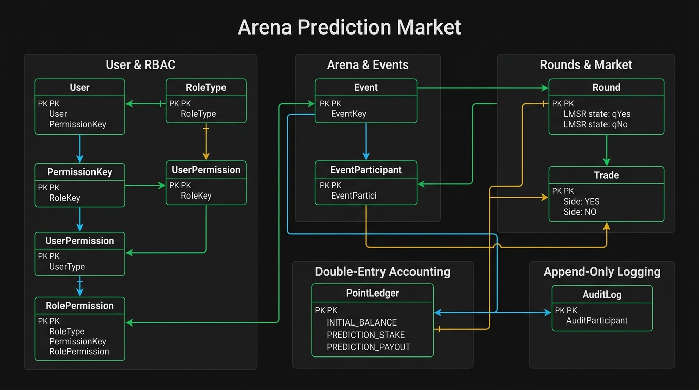

# Arena Database & Authorization Architecture



---

## 1. System Overview & Architecture Pillars

**Arena** is a high-frequency, Polymarket-style campus prediction market engine. The database and security architecture is designed to support:
- **4-Tier Role-Based Access Control (RBAC)**: `SuperAdmin`, `Admin`, `Organizer`, and `Participant`.
- **Resource Ownership Scoping**: Organizers manage only their owned arenas; participants interact strictly with permitted arenas and rounds.
- **Double-Entry Financial Accounting**: Immutable `PointLedger` tracking every credit, debit, stake, payout, and adjustment.
- **Append-Only Security Audit Logging**: `AuditLog` capturing actor, action, resource, IP/device metadata, and state diffs.
- **Automated Oracle Resolution**: Zero manual outcome tampering.

---

## 2. Complete Entity Specifications

### 2.1 Users & RBAC Subsystem
- **`User`**:
  - `id`: String (PK, CUID)
  - `name`: String
  - `email`: String (Unique, Indexed)
  - `passwordHash`: String (bcrypt work factor 12)
  - `role`: `RoleType` (`SUPERADMIN`, `ADMIN`, `ORGANIZER`, `PARTICIPANT`)
  - `status`: `UserStatus` (`ACTIVE`, `SUSPENDED`, `DEACTIVATED`)
  - `lastLoginAt`: DateTime (Nullable)
  - `createdAt`, `updatedAt`: DateTime
  - *Indexes*: `@@index([role, status])`, `@@index([email])`

- **`Permission`**:
  - `id`: String (PK, CUID)
  - `key`: `PermissionKey` (Enum, Unique) — 24 granular capabilities across Users, Arenas, Rounds, Trading, Ledger, and System.
  - `name`: String
  - `category`: String
  - `description`: String

- **`RolePermission`**:
  - Baseline default permissions per `RoleType`.
  - *Constraint*: `@@unique([role, permissionId])`

- **`UserPermission`**:
  - Granular user-specific permission overrides (grant or revoke).
  - *Constraint*: `@@unique([userId, permissionId])`

---

### 2.2 Arena & Event Subsystem
- **`Event` (Arena)**:
  - `id`: String (PK, CUID)
  - `code`: String (Unique, e.g. `AR-M64N`)
  - `name`: String
  - `hostName`: String (Nullable)
  - `organizerId`: String (FK $\rightarrow$ `User.id`, Cascade Delete)
  - `asset`: String (default `"BTCUSDT"`)
  - `roundDurationSec`: Int (default 300)
  - `totalRounds`: Int (default 12)
  - `startingBalance`: Float (default 1000)
  - `liquidityParamB`: Float (LMSR $b$, default 40)
  - `maxStakePerTrade`: Float (default 250)
  - `status`: `EventStatus` (`DRAFT`, `LOBBY`, `LIVE`, `PAUSED`, `ENDED`, `ARCHIVED`)
  - `currentRound`: Int (default 0)
  - `tradesPerMinuteLimit`: Int (Nullable, default 0 for No Limit)
  - `scheduledFor`, `startedAt`, `endsAt`, `resolvedAt`: DateTime (Nullable)
  - `resolvedOutcome`: `Outcome` (`YES`, `NO`, `VOID`, Nullable)
  - *Indexes*: `@@index([status, scheduledFor])`, `@@index([organizerId])`, `@@index([code])`

- **`EventParticipant`**:
  - `id`: String (PK, CUID)
  - `eventId`: String (FK $\rightarrow$ `Event.id`, Cascade Delete)
  - `userId`: String (FK $\rightarrow$ `User.id`, Cascade Delete)
  - `balance`: Float (Spendable point balance)
  - `joinedAt`, `updatedAt`: DateTime
  - *Constraint*: `@@unique([eventId, userId])` (Anti-duplicate join constraint)
  - *Indexes*: `@@index([eventId, balance])`, `@@index([userId])`

---

### 2.3 Rounds & Market Subsystem
- **`Round`**:
  - `id`: String (PK, CUID)
  - `eventId`: String (FK $\rightarrow$ `Event.id`, Cascade Delete)
  - `roundNumber`: Int
  - `openPrice`: Float (Strike price locked at round open)
  - `closePrice`: Float (Settlement price at round close)
  - `outcome`: `Outcome` (`YES`, `NO`, `VOID`, Nullable)
  - `status`: `RoundStatus` (`PENDING`, `TRADING`, `LOCKED`, `RESOLVED`)
  - `qYes`: Float (Cumulative LMSR YES share quantity)
  - `qNo`: Float (Cumulative LMSR NO share quantity)
  - `opensAt`, `locksAt`, `resolvesAt`, `resolvedAt`: DateTime (Nullable)
  - `submissionMode`: `SubmissionRuleMode` (`UNLIMITED_WITH_BALANCE`, `TIME_LIMITED`, `RATE_LIMITED`)
  - `voidReason`: String (Nullable)
  - *Constraint*: `@@unique([eventId, roundNumber])`

- **`Trade` (Immutable Prediction Record)**:
  - `id`: String (PK, CUID)
  - `eventId`: String (FK $\rightarrow$ `Event.id`)
  - `roundId`: String (FK $\rightarrow$ `Round.id`)
  - `userId`: String (FK $\rightarrow$ `User.id`)
  - `participantId`: String (FK $\rightarrow$ `EventParticipant.id`)
  - `side`: `Side` (`YES`, `NO`)
  - `shares`: Float
  - `cost`: Float
  - `priceAtFill`: Float
  - `payout`: Float (Nullable until settlement)
  - `status`: `TradeStatus` (`FILLED`, `SETTLED`, `REFUNDED`)
  - `settledAt`: DateTime (Nullable)
  - `createdAt`: DateTime (Immutable)
  - *Indexes*: `@@index([roundId, createdAt])`, `@@index([participantId])`, `@@index([eventId, userId])`

---

### 2.4 Double-Entry Accounting Subsystem
- **`PointLedger`**:
  - `id`: String (PK, CUID)
  - `eventId`: String (FK $\rightarrow$ `Event.id`)
  - `participantId`: String (FK $\rightarrow$ `EventParticipant.id`)
  - `userId`: String (FK $\rightarrow$ `User.id`)
  - `tradeId`: String (FK $\rightarrow$ `Trade.id`, Nullable)
  - `type`: `LedgerEntryType` (`INITIAL_BALANCE`, `PREDICTION_STAKE`, `PREDICTION_PAYOUT`, `PREDICTION_REFUND`, `ADMIN_ADJUSTMENT`, `SYSTEM_CORRECTION`)
  - `amount`: Float (Positive for credit, negative for debit)
  - `balanceBefore`: Float
  - `balanceAfter`: Float
  - `reason`: String (Nullable)
  - `actorId`: String (Nullable)
  - `createdAt`: DateTime
  - *Indexes*: `@@index([participantId, createdAt])`, `@@index([eventId, createdAt])`, `@@index([userId])`

---

### 2.5 Security Audit Logging Subsystem
- **`AuditLog`**:
  - `id`: String (PK, CUID)
  - `actorId`: String (FK $\rightarrow$ `User.id`, Nullable)
  - `action`: `AuditAction` (`USER_LOGIN`, `USER_SUSPENDED`, `USER_ACTIVATED`, `ROLE_CHANGED`, `PERMISSIONS_UPDATED`, `ARENA_CREATED`, `ARENA_UPDATED`, `ARENA_DELETED`, `ROUND_STARTED`, `ROUND_LOCKED`, `ROUND_RESOLVED`, `POINTS_MANUALLY_ADJUSTED`, `SYSTEM_SETTINGS_UPDATED`)
  - `resourceType`: String (`"USER"`, `"EVENT"`, `"ROUND"`, `"LEDGER"`, `"SYSTEM"`)
  - `resourceId`: String (Nullable)
  - `ipAddress`: String (Nullable)
  - `userAgent`: String (Nullable)
  - `previousData`: JSON (Nullable)
  - `newData`: JSON (Nullable)
  - `metadata`: JSON (Nullable)
  - `createdAt`: DateTime
  - *Indexes*: `@@index([resourceType, resourceId])`, `@@index([actorId, createdAt])`, `@@index([action, createdAt])`

---

## 3. RBAC Permission Matrix

| Permission Key | SUPERADMIN | ADMIN (Granular) | ORGANIZER (Scoped) | PARTICIPANT |
| :--- | :---: | :---: | :---: | :---: |
| **USER_VIEW** | Yes | Configurable | Own Users | Own Profile |
| **USER_CREATE / UPDATE** | Yes | Configurable | No | No |
| **USER_SUSPEND / DELETE** | Yes | Configurable | No | No |
| **ADMIN_MANAGE** | Yes | No | No | No |
| **ROLE_ASSIGN** | Yes | No | No | No |
| **ARENA_VIEW_ALL** | Yes | Configurable | No | No |
| **ARENA_CREATE** | Yes | Configurable | Yes | No |
| **ARENA_MANAGE_OWN** | Yes | Yes | Yes (Own Only) | No |
| **ARENA_MANAGE_ALL** | Yes | Configurable | No | No |
| **ARENA_DELETE_OWN** | Yes | Yes | Yes (Own Only) | No |
| **ARENA_DELETE_ALL** | Yes | Configurable | No | No |
| **ROUND_VIEW** | Yes | Yes | Yes | Yes |
| **ROUND_MANAGE_OWN** | Yes | Yes | Yes (Own Only) | No |
| **ROUND_MANAGE_ALL** | Yes | Configurable | No | No |
| **PREDICTION_VIEW** | Yes | Yes | Yes | Yes |
| **PREDICTION_SUBMIT** | Yes | Yes | Yes | Yes (If balance > 0) |
| **LEDGER_VIEW** | Yes | Configurable | Own Arena | Own History |
| **POINTS_ADJUST** | Yes | Configurable | No | No |
| **AUDIT_LOG_VIEW** | Yes | Configurable | No | No |
| **SYSTEM_SETTINGS_UPDATE**| Yes | No | No | No |

---

## 4. Resource-Level Authorization Pipeline

```
Client Request
      │
      ▼
Authentication (JWT Session)
      │
      ▼
Account Status Check (ACTIVE vs SUSPENDED / DEACTIVATED)
      │
      ▼
SuperAdmin Bypass Check (If SUPERADMIN -> Allow All)
      │
      ▼
Resource Scoping (If Scoped -> Check resource.organizerId === user.id OR ARENA_MANAGE_ALL)
      │
      ▼
Effective Permission Lookup (Baseline Role Permissions ∪ Granted Overrides ∖ Revoked Overrides)
      │
      ▼
Allow / Deny Response
```
